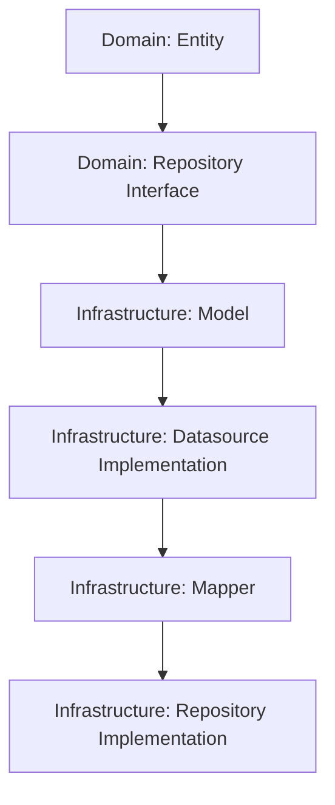

# Arquitectura de Capas: Domain e Infrastructure

Este documento explica cómo funciona la estructura de nuestro proyecto siguiendo los principios de Clean Architecture.

## 1. Capa de Dominio (`lib/domain`)

Es el corazón de la aplicación. Es totalmente independiente de librerías externas. Solo contiene lógica de negocio pura.

### ¿Qué se codifica primero?

Normalmente se empieza por aquí:

1.  **Entities (`domain/entities`)**: Define el modelo de datos "ideal" para tu aplicación. Es lo que usarás en la UI.
2.  **Datasources / Repositories Interfaces (`domain/repositories` y `domain/datasources`)**: Defines **qué** debe hacer el sistema (los contratos o clases abstractas), pero no **cómo** lo hace.

---

## 2. Capa de Infraestructura (`lib/infrastructure`)

Es la implementación de los contratos definidos en el dominio. Aquí es donde se habla con el exterior (APIs, Firebase, Local Storage).

### ¿Qué se codifica después?

Una vez definido el dominio, sigues este orden:

1.  **Models (`infrastructure/models`)**: Representan la estructura exacta de los datos que vienen de fuera (ej. un JSON de una API). Suelen tener métodos `fromJson` y `toJson`.
2.  **Mappers (`infrastructure/mappers`)**: Su única función es convertir un **Model** (sucio, con campos de API) en una **Entity** (limpia, para el dominio).
3.  **Datasources Implementation (`infrastructure/datasources`)**: Aquí haces la llamada real con `Dio` o `Http`. Retornas **Models**.
4.  **Repositories Implementation (`infrastructure/repositories`)**: Es el "pegamento". Llama al datasource, recibe un Model, usa el Mapper para convertirlo en Entity y lo devuelve.

---

## Flujo de Trabajo (Resumen)

## Carpetas Adyacentes

- **`lib/presentation`**: Contiene la lógica de la UI (Widgets) y el estado (Providers/Riverpod).
- **`lib/core`**: Utilidades globales, constantes, temas y configuraciones.
- **`lib/data`**: Datos persistentes locales o configuraciones de red base.
